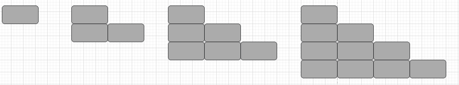

# 1º Edição do Hackthon da dti digital na UFLA!

## Regras

'Content here, content here', making it look like readable English. Many desktop publishing packages and web page editors now use Lorem Ipsum as their default model text, and a search for 'lorem ipsum' will uncover many web sites still in their infancy. Various versions have evolved over the years, sometimes by accident, sometimes on purpose (injected humour and the like)

## Questões

1) Considere uma string ```s``` que pode ser formada por um conjunto de palavras e por espaços em branco. Codifique uma função que receba a string ```s``` e retorne o comprimento da última palavra nessa string.

**Exemplo 1:**

```
Entrada s = "Olá mundo"
Saída: 5
Explicação: A última palavra "mundo" tem o comprimento 5
```

**Exemplo 2:**

```
Entrada s = "  Bora     Bill   "
Saída: 4
Explicação: A última palavra "Bill" tem o comprimento 4
```
---

2) Escreva uma função que receba um número ```n``` e diga se ele é **palito**
   Um número palito é um número definido seguindo o processo:
   * Considerando um número inteiro positivo, substitua o número pela soma dos quadrados de seus algarismos;
   * Repita o processo até que o número seja igual a 1 ou que o digito restante seja diferente de 1;
   * Os numeros que ao final do processo sejam iguais a 1 são palitos.

retorne ```true``` caso o número recebido na função seja **palito** e ```false``` caso não seja.

**Exemplo 1:**

```
Entrada n = 19
Saída: true
Explicação: 
1² + 9² = 82
8² + 2² = 68
6² + 8² = 100
1² + 0² + 0² = 1
```

**Exemplo 2:**

```
Entrada s = 14
Saída: false
Explicação:
1² + 4² = 17
1² + 7² = 50
5² + 0² = 25
2² + 5² = 29
2² + 9² = 85
8² + 5² = 89
8² + 9² = 145
1² + 4² + 5² = 42
4² + 2² = 20
2² + 0² = 4
```

**Exemplo 3:**

```
Entrada n = 6
Saída: false
```

---

3) Dado 2 números inteiros e positivos ```dividendo``` e ```divisor```, crie uma função que receba esses 2 números e retorne o resultado da divisão, o **quociente** de ```dividendo``` por  ```divisor```. O resultado da operação deveria ser truncado, como por exemplo, dado um resultado 5.698 deve ser truncado para 5.

**Exemplo 1:**

```
Entrada: dividendo = 10 e divisor = 3
Saída: 3
Explicação: 10/3 = 3.3333... que truncado é 3
```

**Exemplo 2:**

```
Entrada: dividendo = 15 e divisor = 3
Saída: 5
Explicação: 15/3 = 5
```

Conside ```dividendo``` e ```divisor``` sendo números entre 0 e $2^{31}-1$ com ```divisor``` != 0

---

4) Dado um array de números ```nums``` e um de entrada ```target```, crie uma função que retorne os índices dos dois únicos números que somados equivalem ao ```target```.
Importante: 
* Cada entrada tem exatamente uma solução. 
* Os dois números precisam ser diferentes.

**Exemplo 1:**

```
Entrada: nums = [2,7,11,15], target = 9
Saída: [0,1]
Explicação: Como nums[0] + nums[1] == 9, retornamos [0, 1].
```

**Exemplo 2:**

```
Entrada: nums = [3,2,4], alvo = 6
Saída: [1,2]
Explicação: Como nums[1] + nums[2] == 6, retornamos [1, 2].
```

---

5) Dada uma string ```s``` contendo apenas os caracteres '(', ')', '{', '}', '[' e ']', crie uma função que determine se a string de entrada é válida.

Uma string de entrada é válida se:

Os colchetes abertos devem ser fechados pelo mesmo tipo de colchetes.
Os colchetes abertos devem ser fechados na ordem correta.
Cada colchete fechado tem um colchete aberto correspondente do mesmo tipo.

**Exemplo 1:**

```
Entrada: s = "(())([]{}[])"
Saída: true
```

**Exemplo 2:**

```
Entrada:s = "()([]{])"
Saída: false
```

**Exemplo 3:**

```
Entrada:s = "()([]]])"
Saída: false
```

---

6) Dado um texto ```t``` contendo apenas letras minúsculas e um abre-fecha de parênteses - ```(``` e ```)``` -, crie uma função que retorne o mesmo texto com as letras dentro do () reversas.

**Exemplo 1:**

```
Entrada: t = "abcde(fgh)"
Saída: "abcde(hgf)"
```

**Exemplo 2:**

```
Entrada: t = "(abcd)"
Saída: "(dcba)"
```

**Exemplo 2:**

```
Entrada: t = "(abcd)"
Saída: "(dcba)"
```

**Exemplo 3:**

```
Entrada: t = "abcdefgh()"
Saída: "abcdefgh()"
```

---

7) Dada um array de números ```nums``` inteiros positivos e um ```alvo``` inteiro positivo, crie uma função que retorne o comprimento mínimo de um subarray cuja soma é maior ou igual ao alvo. Se não houver tal subarray, retorne 0 em seu lugar.

**Exemplo 1:**

```
Entrada: alvo = 7, nums = [2,3,1,2,4,3]
Saída: 2
Explicação: O subarray [4,3] tem o comprimento mínimo sob a restrição do problema.
```

**Exemplo 2:**

```
Entrada: alvo = 4, nums = [1,4,4]
Saída: 1
Explicação: O subarray [4,3] tem o comprimento mínimo sob a restrição do problema.
```

**Exemplo 3:**

```
Entrada: alvo = 11, nums = [1,1,1,1,1,1,1,1]
Saída: 0
```

---

8) Dado um array ```nVotosPorCandidato``` do número de votos de cada candidato até o momento e um inteiro ```k``` igual ao número de eleitores que ainda não votaram, crie uma função que retorne o número de candidatos que ainda têm chance de vencer a eleição.

O vencedor da eleição deve obter estritamente mais votos do que qualquer outro candidato. Se dois ou mais candidatos receberem o mesmo (máximo) número de votos, suponha que não haja nenhum vencedor.

**Exemplo 1:**

```
Entrada: nVotosPorCandidato = [2, 3, 5, 2] e k = 3
Saída: 2
Explicação: O primeiro candidato obteve 2 votos. Mesmo que todos os 3 candidatos restantes votem nele, ele ainda terá apenas 5 votos, ou seja, o mesmo número do terceiro candidato, portanto não haverá vencedor. O segundo candidato pode ganhar se todos os candidatos restantes votarem nele (3 + 3 = 6 > 5). O terceiro candidato pode vencer mesmo que nenhum dos candidatos restantes vote nele. Por exemplo, se cada um dos eleitores restantes votar em cada um de seus oponentes, ele ainda será o vencedor (a matriz de votos será [3, 4, 5, 3]). O último candidato não pode vencer de jeito nenhum (pelo mesmo motivo do primeiro candidato). Assim, apenas 2 candidatos podem vencer (o segundo e o terceiro), que é a resposta igual a 2.
```

---

9) Dado duas strings binárias `a` e `b`, crie uma função que retorne a soma das strings binárias

**Exemplo 1:**

```
Entrada: a = "11", b = "1"
Saída: "100"
```

**Exemplo 2:**

```
Entrada: a = "1010", b = "1011"
Saída: "10101"
```

---

10) Imagine que você possui ```n``` blocos para construir uma escadaria. Para cada nova altura ```h``` adicionada na escada deve-se adicionar um bloco em sua base, conforme a imagem a seguir:



